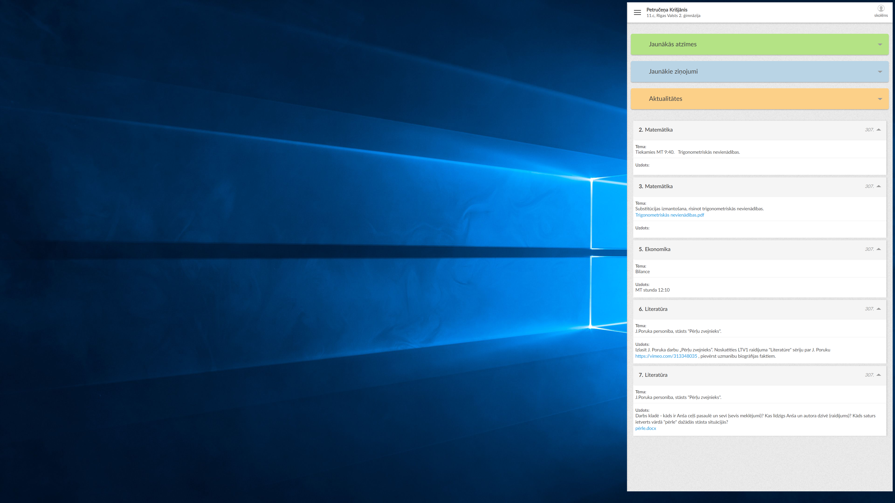

# EklaseWallpaperNodeJS

## Under the hood
The project uses puppeteer to
 1) open a headless browser
 2) login into e-klase using credentials provided in config.js
 3) remove unnecessary stuff
 4) take a screenshot
 5) render the screenshot.png onto wallpaper.jpg and save it as output.jpg
 6) set the output.jpg as wallpaper

## Running the project
1. Get node.js
2. Navigate to project directory
3. Run `npm install`
4. Edit config.js to match your credentials
5. Run `node index`
